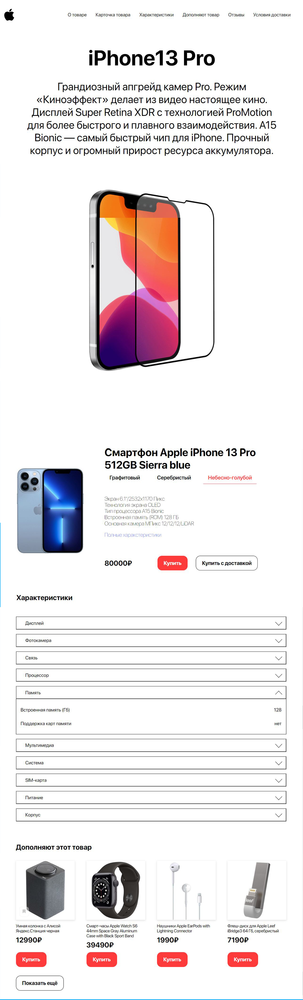

# Cards for online store
### Работа с отдельной карточкой товара (IPhone 13). Целью работы было взаимодействовать с базой данных JSON через JSON-server/fireBase/Json-placeholder(Get/Post запросы через Fetch API)
В данной практической работе реализовано:
* Плавная прокрутка по нажатии на элементы навигационного меню
* Динамическая смена контента при выборе товара(реализованы tab's)
* Подгрузка с JSON database товаров на 4 элемента через Fetch API (Get запрос)
* Отправка заполненной формы на JSON-placeholder через Fetch API (Post запрос)

